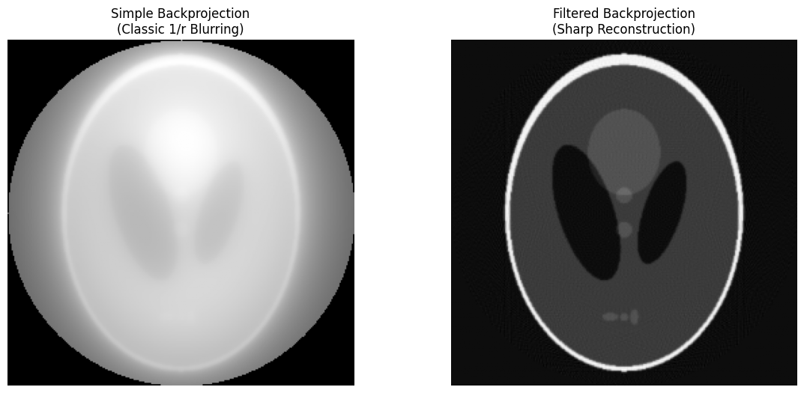
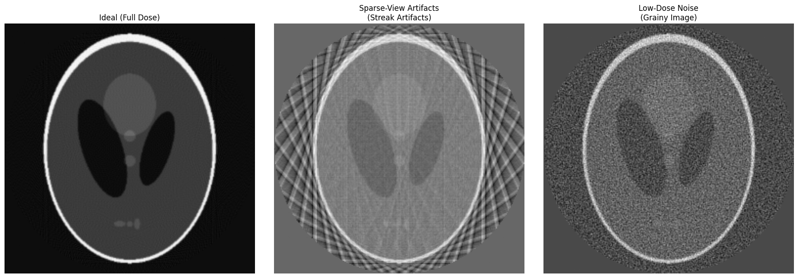

# CT-Foundations: Physics & Reconstruction

[](https://www.python.org/)
[](https://opensource.org/licenses/MIT)

A comprehensive deep-dive into Computed Tomography (CT) imaging, covering the full pipeline from raw X-ray projections (Radon Space) to diagnostic image reconstruction. This project demonstrates the mathematical foundations required for advanced Medical AI applications.

## Project Overview
This repository serves as a pedagogical and technical foundation for understanding how raw X-ray projections are transformed into diagnostic 3D volumes.

## Repository Structure
* `src/`: Python modules for CT operations.
* `notebooks/`: Interactive tutorials and visualizations.
* `tests/`: Automated unit tests ensuring mathematical and structural integrity.
* `data/processed/`: Storage for generated phantoms and reconstruction results.

## Mathematical Core Concepts
*(Work in Progress)*
- [x] Radon Transformation: Mapping 2D objects to Sinograms (Forward Path).
- [x] Central Slice Theorem: Connecting 1D Fourier slices to 2D image space.
- [x] Filtered Back Projection (FBP): Analytical inversion using Ramp (Ram-Lak) filtering.
- [x] Artifact Modeling: Quantitative analysis of 1/r blurring and Poisson-like noise.
  
## Visual Showcase
| Visualization | Description | Plot |
| :-- | :-- | :--- |
| **Simple vs filtered backprojection** | **Left** simple backprojection (blurred) <br>**Right:** filtered reconstruction | ** |
| **Artifacts** | **Left** ideal reconstruction <br>**Mid:** Sparse-view <br>**Right:** Low-Dose | ** |

## Installation & Usage


### Prerequisites
This project uses **uv** for dependency management. Install it via:
```bash
curl -LsSf [https://astral.sh/uv/install.sh](https://astral.sh/uv/install.sh) | sh
```

## Setup
```bash
git clone https://github.com/yannikFruehwirth/ct-reconstruction-foundations
cd ct-reconstruction-foundations
uv sync
```

## Running pipeline
Simulate a Low-Dose CT with noise and specific filtering:
```bash
uv run src/main.py --angles 120 --noise 0.05 --filter shepp-logan
```

## Testing
```bash
uv run pytest
```


## Roadmap
- [x] Phase 1: Core physics and FBP.
- [x] Phase 2: CLI driven artifact and noise simulation
